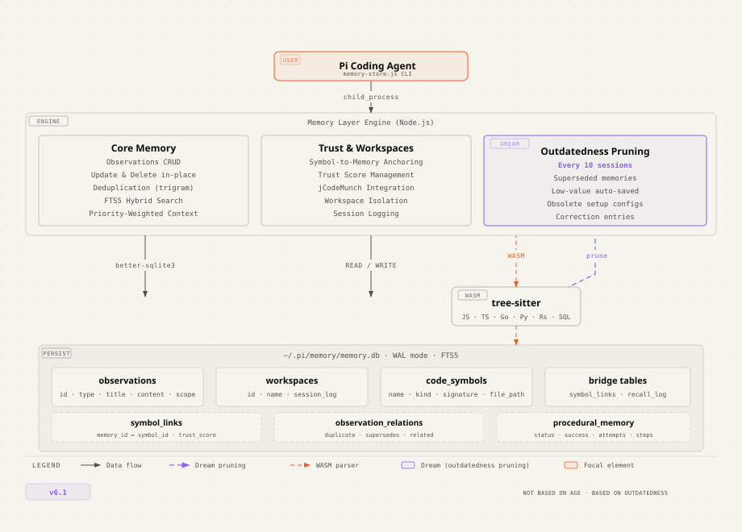

# Pi Memory Layer

Persistent memory for the [Pi coding agent](https://github.com/mariozechner/pi-coding-agent). One SQLite database, zero cloud dependencies, zero API keys.

## Architecture



## One-command install

```bash
curl -fsSL https://raw.githubusercontent.com/genegulanesjr/PiMemoryExtension/main/install.sh | bash
```

Restart Pi and memory auto-wires on session start.

## What it does

- **Remembers across sessions** — decisions, bugfixes, patterns, discoveries persist
- **Auto-injects context** — next session starts with relevant memories loaded
- **Code indexing** — tree-sitter AST parses JS/TS/SQL files, searchable by issue description
- **Trust scoring** — memories linked to changed code lose trust; stable code boosts it
- **Deduplication** — trigram overlap prevents duplicate saves
- **Workspaces** — formal project isolation with create/list/archive
- **Procedural memory** — multi-step workflow tracking
- **Zero servers** — single Node.js CLI + SQLite, called on demand by Pi

## Commands (called by Pi automatically)

| Command | Purpose |
|---|---|
| `save` | Save an observation (decision, bugfix, pattern, etc.) |
| `search` | FTS5 full-text search with hybrid ranking |
| `search --include-code` | Search both memories AND indexed code symbols |
| `context` | Load session context by project |
| `index-repo --path` | Index JS/TS/SQL files with tree-sitter |
| `search-code --query` | Search code symbols by issue description |
| `get-code-source --repo --file --name` | Get full source of a code symbol |
| `list-workspaces` | List all workspaces |
| `create-workspace --name` | Create a workspace |
| `archive-workspace --name` | Archive a workspace |

## Requirements

- Node.js ≥ 22.5 (built-in `node:sqlite`) or `sqlite3` CLI with FTS5
- Python 3.10+ (for tree-sitter code indexing — optional, FTS5 search works without it)

## License

MIT
