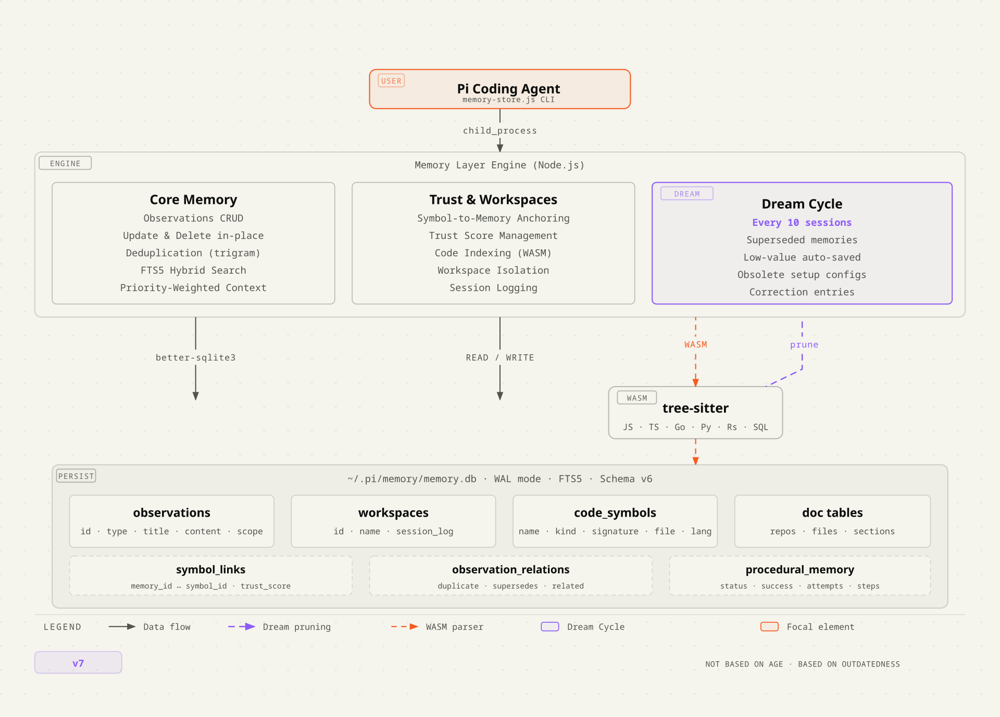
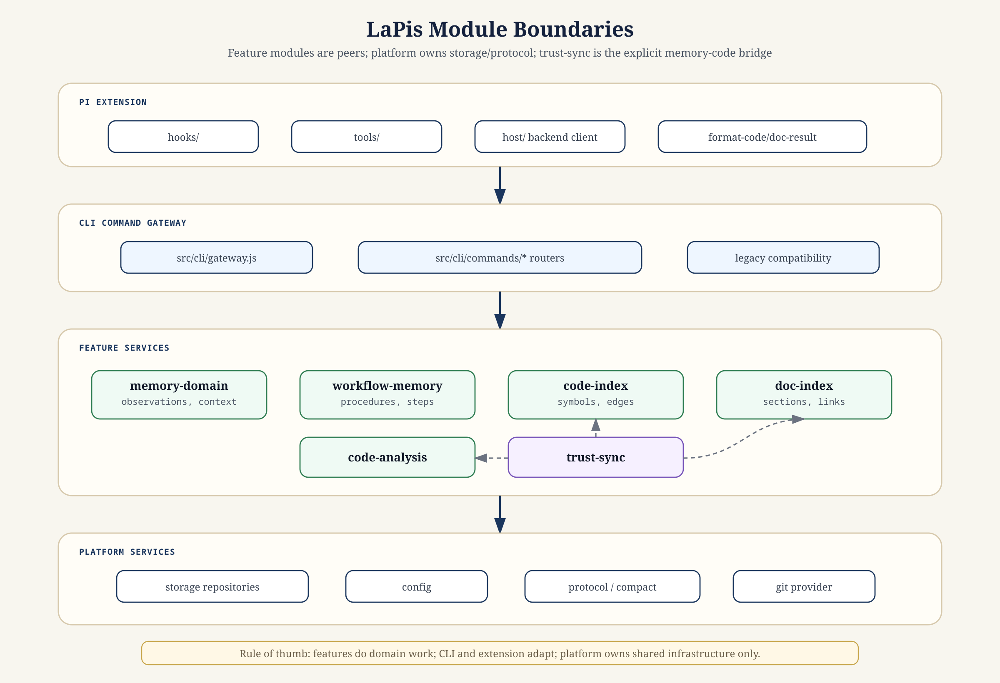
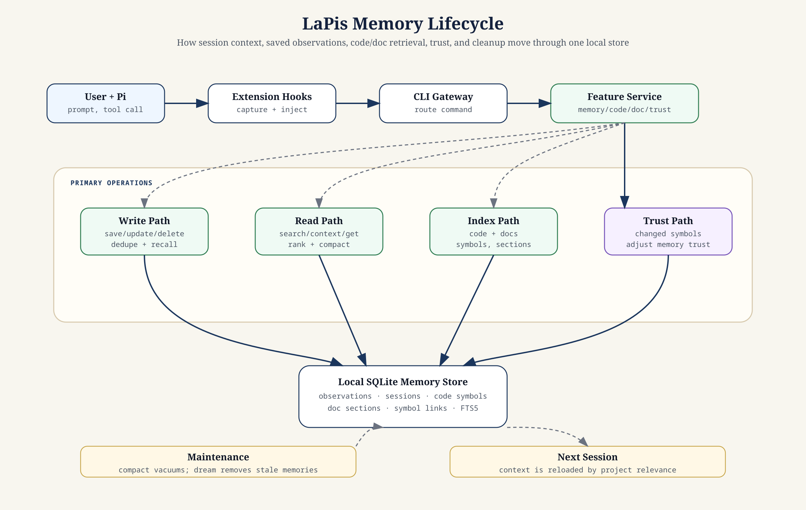

# LaPis

Persistent memory for the [Pi coding agent](https://github.com/earendil-works/pi-coding-agent). LaPis gives Pi a local memory layer for decisions, bugfixes, patterns, indexed code, indexed docs, and session context.

It runs as one Pi extension plus one local Node.js backend. Storage is SQLite by default at `~/.pi/memory/memory.db`; there are no cloud dependencies and no API keys.

## Architecture

LaPis is a modular monolith: one installable extension with clear internal ownership between Pi adapters, CLI routing, feature services, and shared platform/storage code. The extension calls the backend through in-process `dispatch()` when possible, with child-process fallback for streaming operations such as indexing.



### Module boundaries



### Memory lifecycle



For dependency rules and module ownership details, see [`docs/ARCHITECTURE.md`](docs/ARCHITECTURE.md) and [`docs/MODULE_MAP.md`](docs/MODULE_MAP.md).

## Install

```bash
pi install git:github.com/GeneGulanesJr/LaPis
```

Restart Pi and memory auto-wires on session start. Use `pi update --extensions` to keep it up to date.

LaPis does not install npm dependencies at runtime. If you are running from a local clone or developing the extension, install dependencies explicitly:

```bash
npm install
```

## What It Does

- **Remembers across sessions** - decisions, bugfixes, patterns, discoveries, and constraints persist.
- **Auto-injects context** - new sessions start with relevant memories loaded.
- **Indexes code** - web-tree-sitter parses JS/TS/TSX/Go/Python/Rust/SQL for semantic code lookup and analysis.
- **Indexes docs** - Markdown sections, links, glossary terms, and code examples become searchable.
- **Tracks trust** - memories linked to changed code lose confidence; stable linked code recovers trust.
- **Deduplicates memory** - similar saves are merged or flagged before they clutter recall.
- **Manages workspaces** - project isolation is explicit through create/list/archive workflows.
- **Cleans stale memory** - the Dream Cycle removes superseded, never-useful, and replaced memories based on quality signals.

## Benchmarks

### Token Efficiency

The wire format (`wire-format.js`) uses compact encoding to reduce the token footprint of analysis responses inside Pi's context window. The benchmark runs real CLI commands against indexed repos, passes output through `compactResponse()`, and compares byte sizes.

Run it with:

```bash
node bench/bench-tokens.js
```

Latest local run: May 24, 2026, with fresh reindexes for both repos. `call-hierarchy` and `blast-radius` were skipped because the benchmark could not select a representative symbol with callers.

#### Percentage Saved per Tool

| Tool         | LaPis / PiMemoryExtension | PCBuilder |
| :----------- | :-----------------------: | :-------: |
| importance   |            21%            |    24%    |
| hotspots     |            0%             |    0%     |
| dead-code    |            44%            |    50%    |
| coupling     |            37%            |    40%    |
| extraction   |            23%            |    22%    |
| import-graph |            18%            |    20%    |
| cycles       |            0%             |    0%     |
| **overall**  |          **40%**          |  **49%**  |

#### Total Savings

|                | LaPis / PiMemoryExtension |       PCBuilder        |
| :------------- | :-----------------------: | :--------------------: |
| Repo size      |  292 files / 6,913 symbols | 171 files / 207,599 symbols |
| Raw JSON       |         692.6 KB          |        36.7 MB         |
| Compact format |         417.5 KB          |        18.5 MB         |
| Bytes saved    |         275.1 KB          |        18.1 MB         |
| Tokens saved   |       ~80,500 tokens      |    ~5,436,007 tokens   |

See [`bench/README.md`](bench/README.md) for benchmark usage and interpretation notes.

### Paired Memory

The paired benchmark measures whether memory helps by running the same task twice: once with LaPis disabled and once with LaPis active. It is an internal regression and directional benchmark, not a comprehensive external evaluation.

Run it with:

```bash
npm run bench:pi-paired
```

Latest run: `bench/results/pi-paired-2026-05-24T06-53-22-629Z/report.json`

| Metric        | Memory Off | Memory On | Delta     |
| ------------- | ---------- | --------- | --------- |
| Facts correct | 17/18      | 18/18     | +1 fact   |
| Active tokens | 33,842     | 7,019     | -79.3%    |
| Wall time     | ~212s      | ~137s     | -35.4%    |

#### Per-category Breakdown

| Category         | Facts (off -> on) | Tokens (off -> on) | Savings |
| ---------------- | ----------------- | ------------------ | ------- |
| prior-decision   | 2/3 -> 3/3        | 10,730 -> 996      | 90.7%   |
| bug-history      | 3/3 -> 3/3        | 3,485 -> 595       | 82.9%   |
| staleness        | 3/3 -> 3/3        | 10,377 -> 508      | 95.1%   |
| navigation       | 3/3 -> 3/3        | 2,327 -> 89        | 96.2%   |
| negative-control | 6/6 -> 6/6        | 6,923 -> 4,831     | 30.2%   |

Memory-on achieved perfect accuracy with 79.3% fewer active tokens overall. Memory-dependent tasks saved 82.9-96.2% active tokens in this run.

## Requirements

- Node.js
- `@libsql/client` for async local SQLite/libSQL access
- No Python dependency
- No API keys or cloud services

## Documentation

- [`CONTRIBUTING.md`](CONTRIBUTING.md) - contributor workflow and checks.
- [`docs/ARCHITECTURE.md`](docs/ARCHITECTURE.md) - architecture overview and dependency rules.
- [`docs/MODULE_MAP.md`](docs/MODULE_MAP.md) - module ownership and entry points.
- [`docs/COMMANDS.md`](docs/COMMANDS.md) - command reference.
- [`docs/CONFIGURATION.md`](docs/CONFIGURATION.md) - config file and stored data.
- [`docs/DREAM_CYCLE.md`](docs/DREAM_CYCLE.md) - stale-memory cleanup behavior.

## License

MIT
