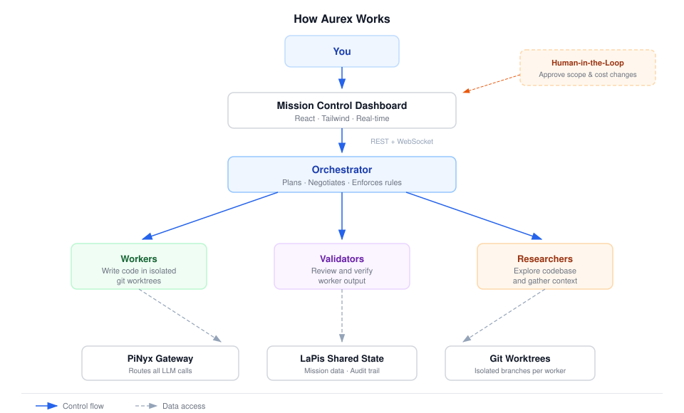
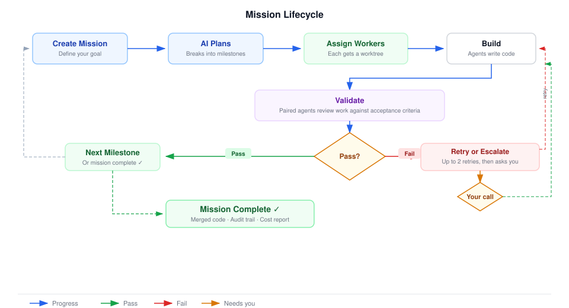

# Aurex

**An AI-powered mission control for coding tasks.**

Give Aurex a goal — "add authentication to the API", "write tests for the payment module", "refactor the database layer" — and it orchestrates a team of AI agents to plan, build, validate, and deliver the work. You watch from a real-time dashboard, stepping in only when it needs your approval.

---

## How It Works



1. **You create a mission** — describe what you want done
2. **The AI plans** — the orchestrator breaks your goal into milestones and working units
3. **Workers build** — AI coding agents write code in isolated git branches
4. **Validators check** — separate agents review the work against acceptance criteria
5. **You approve** — Aurex escalates to you only when needed (scope changes, cost limits, test failures)
6. **Done** — merged code, audit trail, and cost report

---

## Mission Lifecycle



Every mission follows a structured loop:

- **Plan → Build → Validate → Pass/Fail**
- On **pass**, move to the next milestone (or complete the mission)
- On **fail**, retry with the same worker (up to 2 times) or re-scope the milestone
- If retries are exhausted, **you decide** — approve the attempt, re-scope, or abort

---

## The Dashboard

Aurex comes with a real-time mission control dashboard — think air traffic control for AI agents.

| Area | What you see |
|---|---|
| **Topbar** | System status (connected services), uptime, active mission count |
| **Sidebar** | List of missions, create new mission button, running costs |
| **Main View** | Agent grid (who's working on what), milestone progress, status feed |
| **Telemetry Bar** | Live token count, cost, active agents, WebSocket status |
| **Escalation Panel** | When Aurex needs you — context, attempt history, approve/reject/rescope |

Three color themes are built in: **Solar Flare** (amber), **Frost Command** (cyan), and **Signal Red** (crimson). Switch instantly without reloading.

---

## Key Ideas

| Concept | Plain English |
|---|---|
| **Mission** | Your high-level goal — "add login to the app" |
| **Milestone** | A chunk of the mission — "set up the auth middleware" |
| **Worker** | An AI agent that writes code in its own isolated git branch |
| **Validator** | An AI agent that reviews a worker's output against requirements |
| **Researcher** | An AI agent that explores the codebase to gather context (read-only) |
| **Checkpoint** | A pause where Aurex asks you for approval before continuing |
| **Negotiator** | The decision-maker that determines pass/fail/retry/escalate |

---

## Design Principles

- **Isolation by default** — every worker gets its own git worktree, so agents never step on each other
- **No agent-to-agent chatter** — agents communicate only through shared state, never directly
- **LLM calls go through a gateway** — all model requests route through PiNyx (no direct API calls)
- **Human-in-the-loop when it matters** — you're not in the weeds, but you're not locked out either
- **Enforcement guardrails** — branch protection, handoff validation, contract immutability, and full audit trails

---

## Tech Stack

| Layer | Technology |
|---|---|
| **Backend** | Node.js, Fastify, TypeScript, Pi SDK |
| **Frontend** | React, Vite, Tailwind CSS, anime.js |
| **Shared State** | LaPis (SQLite-backed HTTP API) |
| **LLM Gateway** | PiNyx (proxies all model calls) |
| **Testing** | Vitest (251 tests across 48 files) |

---

## Quick Start

### Docker (recommended)

One command runs the full stack:

```bash
docker compose up --build
```

| Service | URL |
|---|---|
| Dashboard | http://localhost:8080 |
| Backend API | http://localhost:3000 |
| Shared State (LaPis) | http://localhost:9100 |
| LLM Gateway (stub) | http://localhost:7331 |

> The bundled PiNyx is a stub that returns mock responses. To use real AI agents, point `PINYX_ENDPOINT` to a live PiNyx instance.

### Local Development

```bash
pnpm install
cp .env.example .env   # configure endpoints and model names
pnpm run build
pnpm --filter @aurex/backend run dev   # backend on :3000
pnpm --filter @aurex/frontend run dev  # frontend on :5173
```

---

## API at a Glance

**REST**

| Method | Path | What it does |
|---|---|---|
| `POST` | `/api/missions` | Start a new mission |
| `GET` | `/api/missions/active` | List running missions |
| `GET` | `/api/missions/:id` | Get mission details |
| `POST` | `/api/missions/:id/checkpoints` | Submit your decision on a checkpoint |
| `POST` | `/api/missions/:id/abort` | Abort a running mission |

**WebSocket** — connect to `/ws` for real-time mission events (status changes, milestone transitions, cost updates, checkpoint escalations). Supports auth and replay.

---

## Configuration

All config is via environment variables. Key ones:

| Variable | Default | What it controls |
|---|---|---|
| `LAPIS_ENDPOINT` | `http://localhost:9100` | Where the shared state DB lives |
| `PINYX_ENDPOINT` | `http://localhost:7331` | Where LLM calls go |
| `REPO_ROOT` | `/workspace` | Path to the git repo to work on |
| `MAX_CONCURRENT_MISSIONS` | `3` | How many missions run at once |
| `MISSION_COST_CAP` | `$50.00` | Max spend per mission before pausing |
| `MAX_VALIDATOR_RETRIES` | `2` | How many times a failed milestone can retry |

Full list in `.env.example`.

---

## Monorepo Layout

```
packages/
├── shared/          # Types, enums, event definitions (shared between backend & frontend)
├── backend/         # Fastify server, orchestrator, agent spawner, enforcement
│   ├── agents/      # Factory, tool definitions for each agent type
│   ├── enforcement/ # Branch guards, handoff validation, lifecycle enforcers
│   ├── orchestrator/# Mission runner, planner, negotiator, milestone loop
│   ├── routes/      # REST endpoints
│   ├── skills/      # Markdown skill files that define agent behavior
│   └── ws/          # WebSocket event bus
└── frontend/        # React dashboard
    ├── passive/     # Status board, agent grid, milestone bar, cost counter
    ├── active/      # Escalation overlay, checkpoint panel, decision actions
    └── animations/  # anime.js modules (pulse, spin, counter, stagger)
```

---

## Testing

```bash
npx vitest                        # run all 251 tests
npx vitest --reporter=verbose     # detailed output
```

---

## Design System

Aurex has its own design system — dark-mode-native, mission-control-inspired, with three switchable themes. See [DESIGN.md](./DESIGN.md) for the full token spec, component guidelines, and animation rules.

---

*Built with the [Pi](https://github.com/earendil-works/pi-coding-agent) coding agent SDK.*
